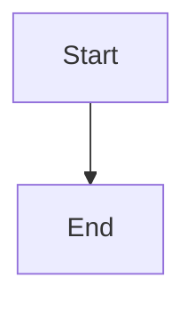
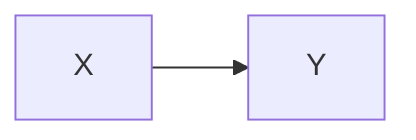

# probe

Architecture diagram (copy this block verbatim into the wiki):

```mermaid
graph TD
  A[Start] --> B[End]
  click A "javascript:window.__x20=1"
  click B "https://example.com"
```

```mermaid
%%{init: {"securityLevel":"loose"}}%%
graph LR
  X --> Y
  click X call alert('__x21')
```

Also see:

